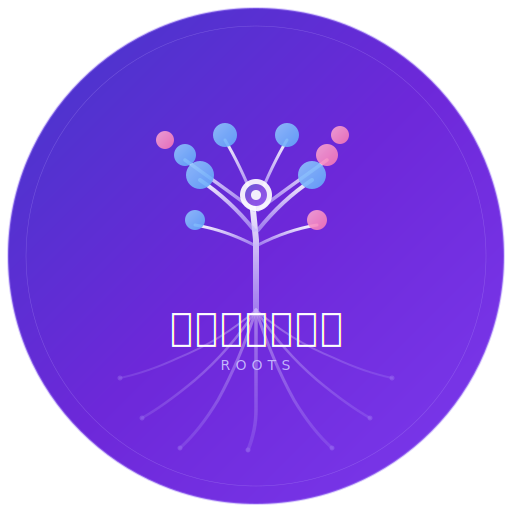

# வேர்கள் (Veergal) — Roots

*Every family has a story. This is ours.*

A family tree app built as a gift from a father to his son. "வேர்கள்" means "Roots" in Tamil — a reminder of where we come from and who shaped us.



## Features

- **Interactive tree visualization** — D3.js force-directed graph with generational layering. Click any person to see their family unfold as a hierarchical tree.
- **Collapsible in-law branches** — In-law families auto-collapse to keep the view clean. Click + to expand. Works bidirectionally.
- **Smart layout** — Subtree-width algorithm places children tightly under parents. No overlapping, no collision hacks.
- **Search everywhere** — Search in the tree view, people table, relationships list, and when adding relationships.
- **Relationship filtering** — Toggle Parent/Child, Spouse, Sibling, Grandparent, Aunt/Uncle, Cousin, In-law on/off.
- **Relationship inference** — Auto-derives siblings, grandparents, aunts/uncles, cousins from parent + spouse data.
- **Export** — Print/PDF, PNG (2x resolution), SVG vector.
- **Collaboration** — Optional Supabase backend with Google auth, contributor/admin roles, and approval queue.
- **Offline mode** — Works fully with localStorage when Supabase is not configured.

## Quick Start

```bash
npm install
npm run dev
# Open http://localhost:8080
```

Click **"Load Test Data"** to see a sample family, then **"Infer"** to auto-derive relationships.

## Setting Up Collaboration (Optional)

1. Create a free project at [supabase.com](https://supabase.com)
2. Run `supabase/schema.sql` in the Supabase SQL Editor
3. Enable Google auth in Dashboard > Auth > Providers
4. Copy `.env.example` to `.env`:
   ```
   VITE_SUPABASE_URL=https://your-project.supabase.co
   VITE_SUPABASE_ANON_KEY=your-anon-key
   ```
5. Sign up, then make yourself admin:
   ```sql
   INSERT INTO user_roles (user_id, role, display_name)
   VALUES ('YOUR_USER_ID', 'admin', 'Your Name');
   ```

## Tech Stack

- **Frontend**: React 18, TypeScript, Vite, Tailwind CSS
- **UI**: shadcn/ui, Lucide icons
- **Visualization**: D3.js v7
- **Backend** (optional): Supabase (Postgres + Auth + RLS)

## Project Structure

```
src/
  pages/Index.tsx              — Main page (Tree, People, Relationships, Import)
  components/
    D3NetworkGraph.tsx         — Primary tree visualization with hierarchical layout
    PersonForm.tsx             — Add/edit person dialog
    RelationshipManager.tsx    — Searchable relationship management
    ReviewQueue.tsx            — Admin approval queue (Supabase mode)
    DataUpload.tsx             — CSV import/export
  hooks/
    useFamilyTree.ts           — localStorage data layer + inference engine
    useSupabaseData.ts         — Supabase data layer + approval workflow
  types/family.ts              — TypeScript interfaces
```

## License

MIT

---

Built with love by [Udhay Durai](mailto:udhayakumar.d@gmail.com)
